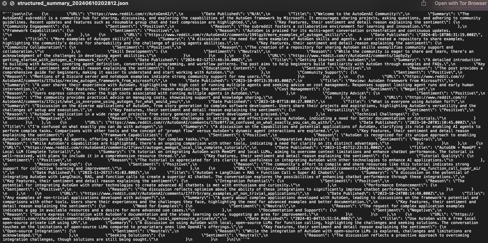

# Autogen Chatbot Interface to Search Reddit Posts and Scrape them (Azure OpenAI)

## Introduction
The project involves creating an Autogen Chatbot Interface designed to search Reddit posts and scrape the content.
The project uses the *GroupChat* class from Autogen and a workflow of specific agents: 
- web_surfer: searches the web for the specified topic (uses the BING API)
- scraper_agent_reddit: scrapes the Reddit Posts (uses the Apify API)
- executor: executes the function programmed for the scraper_agent_reddit
- user_proxy: represents the user

## Project Overview

- Functionality: The chatbot interface allows users to search for information on Reddit based on a specified topic. It scrapes Reddit content, summarizes it in a desired format, and stores the raw scraped content on the local machine. At the end of the session, users can download the summary in a JSON format.
- APIs Required: The interface requires API keys for Azure OpenAI, Apify, and Bing.

## Features

### User Input for Search:
The interface prompts the user to input the topic they want to search on Reddit.

### Summary Prompt:
The user is provided with a structure for summarizing the scraped Reddit content in a JSON format. The user can change this format and also add more requests. 

### API Key Configuration:
Users can input and save their API keys for Azure OpenAI, Apify, and Bing through the interface.

### Scraping and Summarizing Content:
The chatbot searches Reddit for the specified topic, scrapes the relevant posts, and summarizes each one according to the provided structure.

### Data Storage:
The raw scraped content is saved on the local machine automatically.

### Download Summary:
At the end of the session, users can download the summarized data as a JSON file.[Download the structured summary JSON file](./structured_summary_20240610202812.json)

  

## Instructions for Usage
1. Enter API Keys: Provide your Azure OpenAI API Key, Apify API Key, and Bing API Key in the designated fields and save them.
2. Search Topic on Reddit: Enter the topic you want to search on Reddit in the input field.
3. Summary Prompt Structure: Use the given summary prompt structure to format the summaries of the scraped Reddit content (you can change this as required).
4. Start the Search: Click the "Send" button to start the search and scraping process.
5. Save and Download: The raw scraped content is saved locally, and the summarized data can be downloaded as a JSON file once the process is complete.

## Conclusions

- The chatbot effectively retrieves and summarizes Reddit posts based on user queries, making it easier to gather relevant information quickly.
- The project provides a structured way to summarize and download the scraped Reddit content, which can be useful for research or data analysis.
- The integration of Azure OpenAI, Apify, and Bing APIs demonstrates the capability to leverage multiple services for comprehensive web scraping and summarization.
- The ability to save raw scraped content and download the summarized data ensures that users can retain the information for future use.
- The project can be scaled to include more sources or improve the summarization techniques, making it a versatile tool for data gathering.
